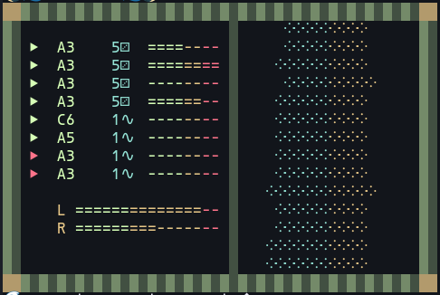

# 🌘🌊 Tidalua 🌊🌒
An experimental synthesizer that uses Lua scripts to generate sound in a "live coding" environment.



What is it?
- A modular synthesizer
- A tracker
- A live coding environment
- A fun programming toy

What isn't it?
- A full featured DAW
- A "professional" synthesizer
- A traditional tracker
- A "serious" audio tool
- Lab equipment

### Scripting Example
```lua
-- Set the waveform for the first voice to square
wave(2, 1)
-- Play a note
note("C4", 1)
-- Create an LFO that oscillates between -1 and 1 every second
local lfo = math.sin(seconds * 2)
-- Set the pan of the first voice to the LFO value
pan(lfo, 1)
-- We can use the same LFO again to detune the oscillator
-- Set the detune of the first voice to the LFO value divided by 2
detune(lfo / 2, 1)
```

# OS Support
- ✅ Linux
- ✅ MacOS
- ❓ Windows 

# Building
## External Build Dependencies
- `curl`
- `tar`
- `make`
- `cmake`
- `clang` or `gcc`

## First Build
Initialize the build environment. This script downloads and sets up the necessary dependencies and builds the project.
```bash
./init.sh
```

Once the project has been initialized you can rebuild it with:
```bash
./build.sh
```

The binary and scripts will be placed in the `./out` directory.

# Running
```bash
./tidalua <script_path>.lua [ d | v ] 
```
Example:
```bash
./tidalua scripts/lfo.lua
```

- `d` - Debug mode
- `v` - Visual mode (experimental and not fully functional)

# Scripting
- Oscillator numbers start at 1.
  - Lua indexes start at 1 in general.
- There are 8 oscillators total.
    - The range for any `oscillator_number` param is `1 -> 8` (integer).
- Most functions that take an `oscillator_numer` param will default to 1 if not provided.
- Only the first oscillator is enabled by default.
    - Use `enable(oscillator_number)` to enable others.
- Lua scripts are run in full before the any samples are generated
    - This means whatever the last state the script leaves the synth in is what will be heard.
- Scripts are run periodically as the synth is running (once per tick).
- The lua environment is reset every time the script is run.
	- This means that any variables set in the script will be lost.
- Scripts will "hot reload" as the synth is running. Providing a "live coding" environment.
- Use the `tick` or `seconds` globals to track time. 
    - This is the basis for creating time based effect.

## Lua API Globals

### `seconds`
The number of seconds that have passed since the synth started.

### `tick`
The current tick number. This is the basis for creating time based effects.

By default, there are 128 ticks per second. See `speed()` for info about changing this. 

## Lua API Functions
### `dbg(message)`
Prints a message to the console if the console output mode is set to debug.

```lua
-- Prints "Hello, world!" to the console if the console output mode is set to debug
dbg("Hello, world!")
```

### `enable(oscillator_number)`
Enables an oscillator. The first oscillator is enabled by default.

```lua
-- Enable the second oscillator
enable(2)
```

### `disable(oscillator_number)`
Disables an oscillator.

```Lua
-- Disable the first oscillator
disable(1)
```

### `freq(frequency, oscillator_number)`
Sets the frequency of an oscillator in Hz.

```lua
-- Set the frequency of the first oscillator to 440 Hz
freq(440, 1)
```

*Range Float: `0.0 -> 22050.0`*

### `note(note, oscillator_number)`
Sets the frequency of an oscillator to a given note name (string) or MIDI note value (number).

```lua
-- Set the frequency of the first oscillator to A4
note("A4", 1)
-- Set the frequency of the second oscillator to A4 using midi notes
note(69, 2)
```

*Range String: `C0 -> C17`*

*Range Integer: `0 -> 127`*

### `detune(cents, oscillator_number)`
Sets the detune of an oscillator as a factor of the frequency.

```Lua
-- Detune the first oscillator by 50%
detune(0.5, 1)
```

*Range Float: `0.0 -> infinity`*

### `amp(amplitude, oscillator_number)`
Sets the amplitude of an oscillator.

This is independent of the master volume and amplitude envelopes.

```lua
-- Set the amplitude of the first oscillator to 0.5
amp(0.5, 1)
```

*Range Float: `0.0 -> 1.0`*

### `env(attack, sustain, release, oscillator_number)`
Sets the attack, sustain and release (measured in ticks) of an oscillator for use in an amplitude envelope.

- The amplitude envelope is applied as a factor of the amplitude set with `amp()`.
- By default, an oscillator does not use an amplitude envelope at all.
- The amplitude envelope will be applied to the oscillator only after it's been enabled by the `env` function.
- For an amplitude envelope to work, the note must be triggered only once then allowed to play out.
- The envelope position is reset every time the note is triggered.
	- We need to make sure the total length of the envelope is less than the total length of the note.

```lua
-- Set the attack, sustain and release of the first oscillator to 8, 64, 128 ticks
env(8, 64, 128, 1)
-- The total length of this envelope is 200 ticks
-- Play it every 256 ticks to allow it to play out
if tick % 256 == 1 then
  note("C4", 1)
end
```

*Range Float: `0.0 -> infinity`*

### `wave(waveform_number, oscillator_number)`
Sets the waveform of an oscillator.
```
-- waveform_number
-- 0 = Off      1 = Sine
-- 2 = Square   3 = Sawtooth
-- 4 = Triangle 5 = Noise
```

```lua
-- Set the waveform of the first oscillator to Square
wave(2, 1)
```

*Range Integer: `0 -> 5`*

### `pan(pan, oscillator_number)`
Sets the pan of an oscillator.

A value of -1 is full left, 0 is center, and 1 is full right.

```lua
-- Set the pan of the first oscillator to full left
pan(-1, 1)
```

*Range Float: `-1.0 -> 1.0`*

### `solo(oscillator_number)`
Sets an oscillator to solo mode. Only the soloed oscillator will be heard.

This is mostly used for debugging scripts. There is no easy way to "un-solo" an oscillator.

```lua
-- Solo the first oscillator
solo(1)
```

### `lowpass(cutoff, resonance, oscillator_number)`
Sets the lowpass filter of an oscillator.

```lua
-- Set the lowpass filter of the first oscillator
lowpass(1000, 0.5, 1)
```

*Cutoff Range Float: `0.0 -> 22050.0`*

*Resonance Range Float: `0.0 -> infinity`*

### `highpass(cutoff, resonance, oscillator_number)`
Sets the highpass filter of an oscillator.

```lua
-- Set the highpass filter of the first oscillator
highpass(1000, 0.5, 1)
```

*Cutoff Range Float: `0.0 -> 22050.0`*

*Resonance Range Float: `0.0 -> infinity`*

### `speed(speed)`
Sets the tick rate for the script.

For example setting the tick rate to `0.5` would result in 64 ticks per second instead of 128.

We can think of the default speed (1.0) as being 120 BPM (beats per minute). 120 BPM means 2 beats per second. So a single beat is 0.5 seconds long or 64 ticks. 

- It is not possible to increase the tick speed. 
	- However, 128 ticks per second is very fast (nearly audio rate).
- The Lua script is run once per tick. 
	- Lowering the tick speed also means that the Lua script will be run less frequently.

```lua
-- Set the tick speed to 0.5
speed(0.5)
```

*Range Float: `0.0 -> 1.0`*

### `mem_set(value, mem_index)`
Sets a value in the memory array at the given index. The Lua state is reset each tick. This is allows for storing values that can be accessed by susequent runs of the script.

- Values may only be numbers (int or float).
- There are 16 memory locations
    - Like all other indices, the first memory location is 1.
- Everything is stored as a float behind the scenes. 
- Lua does not really have a concept of integer vs float types.
    - However this distiction can be important when dealing with array (table) indices.
- So, if you supply an integer value to `mem_set()`, the `mem_get()` function will return an integer.

```lua
-- Set the value at index 0 to 1.0
-- This is treated as an integer since it has no fractional part
mem_set(1.0, 1)
```

*Range Float: `-infinity -> infinity`*

### `mem_get(mem_index)`
Gets a value from the memory array at the given index.
- Values are returned as floats or integers depending on how they were set.
- See `mem_set()` for more info.
```lua
-- Get the value at index 1
local value = mem_get(1)
```

### `bus_lowpass(cutoff, resonance)`
Sets the lowpass filter of the master bus.

```lua
-- Set the lowpass filter of the master bus
bus_lowpass(1000, 0.5)
```

*Cutoff Range Float: `0.0 -> 22050.0` (half of the sample rate)*

*Resonance Range Float: `0.0 -> infinity`*

### `bus_amp(amplitude)`
Sets the amplitude of the master bus.
```lua
-- Set the amplitude of the master bus to 0.5
bus_amp(0.5)
```

*Range Float: `0.0 -> 1.0`*

### Examples
See the `scripts` directory for examples.

